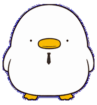
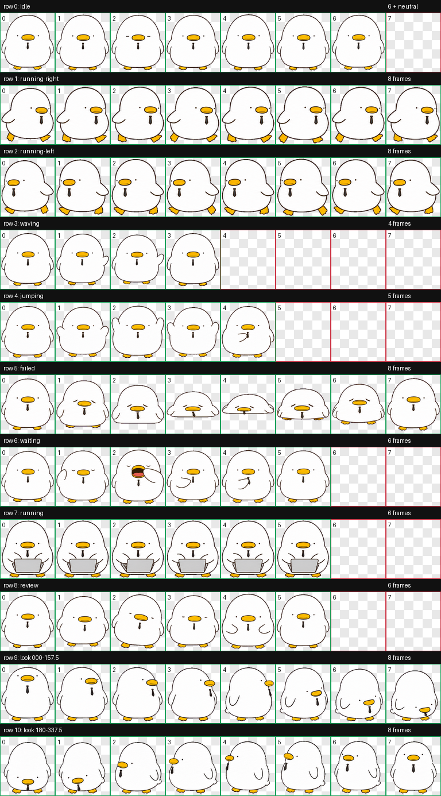

<div align="center">

# 🦆 Clockout Duck — Codex Desktop Pet

### Sleepy face. Tiny tie. Work still gets done.



[](https://github.com/topics/codex-pet)
[](#quick-install)
[](#notice)

**[English](#english) · [한국어](#한국어)**

</div>

---

<a id="english"></a>

## English

Clockout Duck is a round, sleepy **office duck desktop pet** for the
**Codex desktop app**.

He would rather go home, but he is strangely dependable: he types on a tiny
silver laptop while Codex works, yawns while waiting, and celebrates quietly
when the job is done. His short black tie stays on through all of it.

### ✨ What is included?

- 9 animated work states for idle, movement, greeting, waiting, working,
  reviewing, success, and failure
- 16 look directions
- A round white body, tiny dot eyes, yellow bill, and short black office tie
- Tiny silver laptop animation while Codex is working
- Transparent Codex v2 sprite atlas
- Simple Windows PowerShell installer

## 📦 Install

<a id="quick-install"></a>

### Option 1 — Quick install with PowerShell

1. Open the Windows **Start menu**.
2. Search for **PowerShell** and open it.
3. Copy the command below, paste it into PowerShell, and press **Enter**.

```powershell
irm https://raw.githubusercontent.com/iamdw1788/clockout-duck-codex-pet/main/install.ps1 | iex
```

4. Open **Codex**.
5. Go to **Settings → Pets**.
6. Press the **refresh button** near the top of the pet list.
7. Find **Clockout Duck** and press **Select**.

> Administrator permission is not required.

### Option 2 — Manual install

1. Download [`pet.json`](./pet.json) and
   [`spritesheet.webp`](./spritesheet.webp).
2. Press `Win + R`, paste this path, and press **Enter**:

```text
%USERPROFILE%\.codex\pets
```

3. Create a folder named `clockout-duck`.
4. Put both downloaded files inside it:

```text
.codex/
└── pets/
    └── clockout-duck/
        ├── pet.json
        └── spritesheet.webp
```

5. In Codex, open **Settings → Pets**, refresh the list, and select
   **Clockout Duck**.

## 🔄 Update

Run the quick-install command again, then refresh the pet list or restart
Codex.

## 🗑️ Uninstall

Close Codex, open PowerShell, and run:

```powershell
Remove-Item -LiteralPath "$env:USERPROFILE\.codex\pets\clockout-duck" -Recurse
```

This removes only Clockout Duck.

## ⚠️ Known Codex drag issue

After moving a desktop pet, Codex may temporarily make only the upper part of
the character draggable. Clockout Duck's large round body makes this easier to
notice, but the same behavior can occur with built-in pets and other custom
pets.

This is caused by the Codex desktop overlay's pointer region becoming
misaligned after the pet window moves. The sprite file cannot define or repair
that drag region, so this needs to be fixed in the Codex desktop app by OpenAI.

**Workaround**

1. Move the pet to the position you want.
2. Open **Settings → Pets**.
3. Select another pet, then select **Clockout Duck** again.
4. Avoid moving it again after the drag region resets.

## 🛠️ Troubleshooting

### Clockout Duck does not appear

- Confirm the folder is exactly `.codex\pets\clockout-duck`.
- Confirm it contains both `pet.json` and `spritesheet.webp`.
- Refresh **Settings → Pets**.
- Fully quit and reopen Codex if needed.

### The previous version is still visible

Run the update command again and fully restart Codex. The installer replaces
the two existing pet files.

### PowerShell is blocked on a managed computer

Use the manual installation method instead.

## 🎞️ Animations



---

<a id="한국어"></a>

## 한국어

퇴근덕은 **Codex 데스크톱 앱**에서 함께 일하는 동글동글한 흰색
**직장인 오리 데스크톱 펫**입니다.

졸리고 귀찮고 퇴근하고 싶지만 맡은 일은 묘하게 잘합니다. Codex가
작업할 때는 작은 은색 노트북으로 빠르게 타이핑하고, 기다릴 때는
하품하며, 일이 끝나면 조용히 기뻐합니다. 짧고 얇은 검정 넥타이가
퇴근덕의 포인트입니다.

### ✨ 포함된 동작

- 대기, 이동, 인사, 기다림, 작업, 검토, 완료, 실패 등 9가지 상태
- 자연스럽게 이어지는 16방향 시선
- 작은 점눈, 노란 부리, 짧은 검정 넥타이
- 작업 중 작은 은색 노트북 타이핑
- 투명 배경의 Codex v2 스프라이트
- Windows PowerShell 간편 설치 스크립트

## 📦 설치하기

### 방법 1 — PowerShell 간편 설치

1. Windows **시작 메뉴**를 엽니다.
2. `PowerShell`을 검색해 실행합니다.
3. 아래 명령어를 복사해 붙여넣고 **Enter**를 누릅니다.

```powershell
irm https://raw.githubusercontent.com/iamdw1788/clockout-duck-codex-pet/main/install.ps1 | iex
```

4. **Codex**를 실행합니다.
5. **설정 → 반려동물**로 이동합니다.
6. 펫 목록 위쪽의 **새로고침 버튼**을 누릅니다.
7. **Clockout Duck**을 찾아 **선택**을 누릅니다.

> 관리자 권한은 필요하지 않습니다.

### 방법 2 — 직접 설치

1. [`pet.json`](./pet.json)과
   [`spritesheet.webp`](./spritesheet.webp)를 내려받습니다.
2. `Win + R`을 누르고 아래 경로를 붙여넣은 뒤 **Enter**를 누릅니다.

```text
%USERPROFILE%\.codex\pets
```

3. `clockout-duck` 폴더를 만듭니다.
4. 내려받은 두 파일을 폴더 안에 넣습니다.
5. Codex의 **설정 → 반려동물**에서 목록을 새로고침하고
   **Clockout Duck**을 선택합니다.

## 🔄 업데이트하기

간편 설치 명령어를 다시 실행한 다음 펫 목록을 새로고침하거나 Codex를
완전히 종료했다가 다시 실행합니다.

## 🗑️ 삭제하기

Codex를 종료하고 PowerShell에서 아래 명령어를 실행합니다.

```powershell
Remove-Item -LiteralPath "$env:USERPROFILE\.codex\pets\clockout-duck" -Recurse
```

다른 펫에는 영향을 주지 않고 퇴근덕만 삭제합니다.

## ⚠️ 펫 이동 후 드래그가 잘 안 되는 경우

펫을 움직인 직후 캐릭터의 윗부분만 잡히고 몸통은 드래그되지 않는
현상이 생길 수 있습니다. 퇴근덕은 머리와 몸통이 크고 둥글어서 이
현상이 더 눈에 띄지만, 기본 펫과 다른 커스텀 펫에서도 동일하게
발생할 수 있습니다.

펫을 이동한 뒤 Codex 데스크톱 오버레이의 마우스 판정 좌표가 실제
캐릭터 위치와 어긋나는 문제입니다. 펫 스프라이트에는 드래그 영역을
지정하는 설정이 없기 때문에 펫 파일만으로는 고칠 수 없으며,
OpenAI가 Codex 데스크톱 앱에서 수정해야 합니다.

**임시 해결 방법**

1. 펫을 원하는 위치로 옮깁니다.
2. **설정 → 반려동물**을 엽니다.
3. 다른 펫을 선택한 뒤 다시 **Clockout Duck**을 선택합니다.
4. 드래그 영역이 초기화된 뒤에는 펫을 다시 움직이지 않습니다.

## 🛠️ 문제 해결

### 펫 목록에 퇴근덕이 보이지 않아요

- 폴더 경로가 `.codex\pets\clockout-duck`인지 확인합니다.
- 폴더에 `pet.json`과 `spritesheet.webp`가 모두 있는지 확인합니다.
- **설정 → 반려동물**에서 새로고침 버튼을 누릅니다.
- 그래도 보이지 않으면 Codex를 완전히 종료했다가 다시 실행합니다.

### 이전 모습이 계속 보여요

업데이트 명령어를 다시 실행한 뒤 Codex를 완전히 재시작합니다.

### 회사 컴퓨터에서 PowerShell 명령어가 차단돼요

위의 **직접 설치** 방법을 사용하세요.

## 🎞️ 전체 동작


---

## 📁 Package

```text
clockout-duck-codex-pet/
├── pet.json
├── spritesheet.webp
├── install.ps1
└── assets/
    ├── clockout-duck-idle.gif
    ├── preview.png
    └── contact-sheet.png
```

## 📌 Notice

This is an unofficial, non-commercial fan-made desktop pet. It is not
affiliated with or endorsed by OpenAI or Kakao.

Please do not sell or commercially redistribute the character assets.

## ⭐ Like Clockout Duck?

If this sleepy little coworker made your coding day better, please leave a
star. It helps more Codex users find him.

